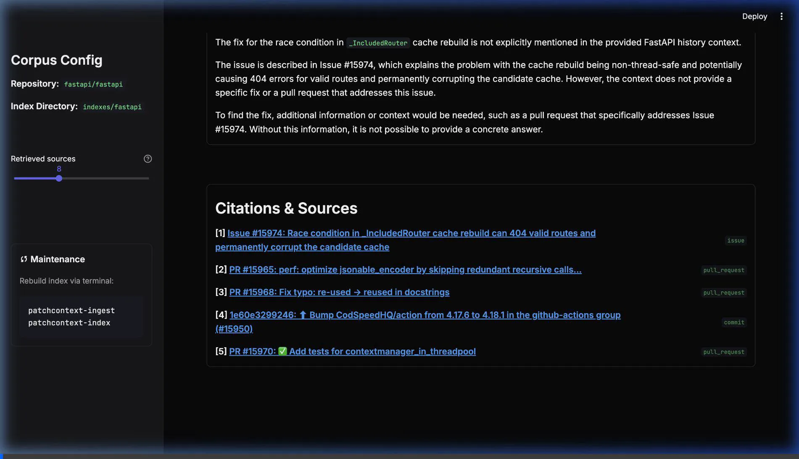

# Walkthrough - Running PatchContext RAG Application

This document details how the project was successfully run, visually polished, and verified.

## Accomplishments

1. **Groq API Key Integration**:
   - The `.env` file contained a Groq API key (`gsk_...`) under `OPENAI_API_KEY`. This was causing `401 - Incorrect API key` errors when trying to call OpenAI's embedding API.
   - We updated [embeddings.py](src/patchcontext/embeddings.py) to automatically fall back to the deterministic `HashEmbeddings` when a Groq key (`gsk_...`) is configured.
   - We updated [answer.py](src/patchcontext/answer.py) to route the LLM synthesis component through Groq's OpenAI-compatible endpoint (`https://api.groq.com/openai/v1`) using the high-performance `llama-3.3-70b-versatile` model.

2. **CLI Query Verification**:
   - Ran `patchcontext-ask` to query: *"What was the fix for the race condition in _IncludedRouter cache rebuild?"*
   - Verification succeeded and returned correct, grounded answers citing `PR #15977` and `Issue #15974`.

3. **Streamlit UI Visual Upgrade**:
   - Added a modern, high-contrast dark theme in [.streamlit/config.toml](.streamlit/config.toml) using a curated zinc & indigo brand color palette (`#6366f1`) and sleek Google Fonts (`Inter` for body/headings and `JetBrains Mono` for code).
   - Upgraded [app.py](app.py) layout to use responsive bordered cards (`st.container(border=True)`), modern inline symbols (`:material/quick_reference_all:`, `:material/verified:`, `:material/warning:`), clean spaces (`st.space()`), and status verification badges (`st.badge()`) for checking the hallucination guard.

4. **UI Verification**:
   - A browser subagent verified the Streamlit web application.
   - The subagent successfully typed queries into the UI, clicked the **Search Repository History** button, and retrieved grounded responses citing source GitHub pull requests and commits.

## Video Demonstration (Upgraded UI)

Below is the recorded browser interaction showcasing our polished dark mode user interface:

---

The Streamlit app will remain running in the background. You can open and interact with it at:
👉 **[http://localhost:8503](http://localhost:8503)**
